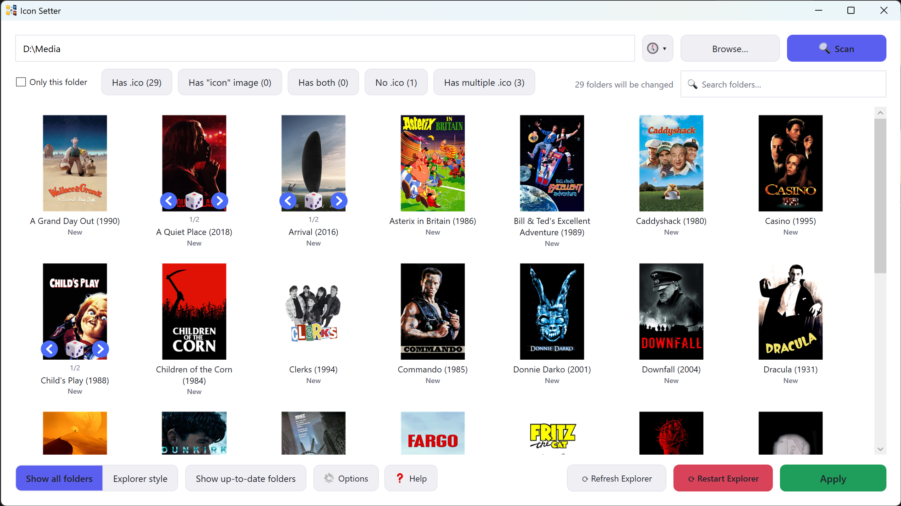

# IconSetter

*A portable Windows utility that automatically assigns custom folder icons in bulk.*



[⬇ Download Latest Release](../../releases/latest)

---

## Features

- Automatically assigns folder icons based on the .ico file in each folder
- Processes subfolders recursively
- Can automatically generate .ico files from image files
- Optionally randomizes icons when multiple are available
- New icons appear right away, no need to restart Explorer
- Respects existing desktop.ini files, if you're using a custom desktop.ini file for say, giving a custom name to a folder, this will be kept!
- Fast and lightweight
- Portable, all-in-one EXE
- Open source

---

## Why?

Manually assigning folder icons to hundreds of folders is tedious.

IconSetter automates the process, scanning folder trees and applying unique icons to all your folders in just a few clicks.

---

## Installation

There isn't one!

Simply download `IconSetter.exe` from the latest release and run it.

---

## Building

Requires the .NET 8 SDK.

```bat
build.bat
```

or

```bash
dotnet publish -c Release
```

---

## How to Use

1. Place an .ico file or image file (supported formats are .png, .jpg, .jpeg and .bmp) that starts with "icon" (you can add whatever you like after), inside the folders you want to customize.
2. Launch IconSetter.
3. Select the parent folder.
4. Click "Apply".
5. Done!

---

## License

MIT License.
